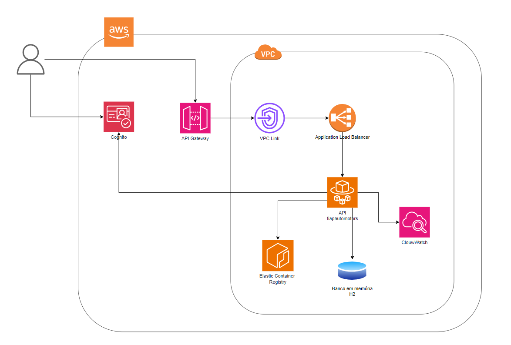

# Fiap Auto Motors

Este projeto é uma aplicação Java com Spring Boot desenvolvida para o cadastro de clientes e veículos, além da simulação de compra de veículos disponíveis. A aplicação está integrada com serviços da AWS para autenticação, deploy e gerenciamento.



---

## 📋 Funcionalidades

- Cadastro de **clientes** com integração **AWS Cognito**.
- Cadastro/Edição e Consulta de **veículos** disponíveis para compra.
- **Compra de veículos** por clientes autenticados.
- Consulta das **compra** realizadas.
- Persistência em banco de dados **H2 em memória**.
- Deploy automatizado na **AWS Fargate**.
- Autenticação com **AWS Cognito**.
- Imagem Docker publicada no **AWS ECR**.
- Acesso externo via **API Gateway**.

## 📌 Importante
- O cadastro de cliente também realiza o cadastro no Cognito.
- Na compra o backend obtém o ID do usuário (sub) a partir do token enviado no header.

---

## 🛠️ Como executar localmente

1. **Pré-requisitos**:
- Java 17+
- Maven 3.5.5+
- Docker (opcional)
- Postman / cURL para testar

2. **Clone o repositório**:

```bash
git clone https://github.com/MonicaThamiris/fiapautomotors.git
cd fiapautomotors
```

3. **Executar a aplicação**:

```bash
mvn spring-boot:run
```

A aplicação sobe em: **http://localhost:8080/fiapautomotors**

4. Console H2 (opcional)
- **URL:** `http://localhost:8080/fiapautomotors/h2-ui`
- **JDBC URL:** `jdbc:h2:mem:fiapautomotors`
- **User:** `sa`
- **Password:** `admin`

---

## 🔗 Endpoints

`context-path: /fiapautomotors`

### 👤 Cliente
- **Cadastrar cliente** *(rota integrada com AWS Cognito)*   
  `POST /cliente`  
  **Body (exemplo):**
  ```json
    {
        "nome": "Monica",
        "dataNascimento": "1994-02-26",
        "documento": "12345678901",
        "email": "monica.teste@gmail.com",
        "senha": "Teste@123"
    }
  ```
  **Response (201 Created):**
  ```json
    {
        "id": "54987468-6021-7048-080a-e85e93754c12",
        "nome": "Monica",
        "dataNascimento": "1994-02-26",
        "documento": "42907400819",
        "email": "monica.teste@gmail.com"
    }
  ```

### 🚙 Veículo
- **Cadastrar veículo**  
  `POST /veiculo`  
  **Body (exemplo):**
  ```json
    {
        "marca": "Toyota",
        "modelo": "Etios",
        "ano": "2015",
        "cor": "Branco",
        "preco": 50.000
    }
  ```
  **Response (201 Created):**
  ```json
    {
        "id": "49082ebb-6b85-4fec-a31d-60c1267b651f",
        "marca": "Toyota",
        "modelo": "Etios",
        "ano": "2015",
        "cor": "Branco",
        "preco": 50.000
    }
  ```

- **Editar veículo**  
  `PATCH /veiculo/{id}`  
  **Body (exemplo):**
  ```json
    {
        "ano": "2015",
        "preco": 60.000
    }
  ```
  **Response (200 OK):**
  ```json
    {
        "id": "49082ebb-6b85-4fec-a31d-60c1267b651f",
        "marca": "Toyota",
        "modelo": "Etios",
        "ano": "2015",
        "cor": "Branco",
        "preco": 60.00
  }
  ```

- **Consultar todos os veículos**  
  `GET /veiculo`

  **Response (200 OK):**
  ```json
  [
    {
      "id": "49082ebb-6b85-4fec-a31d-60c1267b651f",
      "marca": "Toyota",
      "modelo": "Etios",
      "ano": "2016",
      "cor": "Branco",
      "preco": 50.00,
      "status": "DISPONIVEL",
      "dataHoraCriacao": "2025-09-29T20:59:53",
      "dataHoraAtualizacao": "2025-09-29T21:01:08"
    },
    {
      "id": "749d6650-1b9b-427c-8770-3d160892a1ff",
      "marca": "Hyundai",
      "modelo": "HB20",
      "ano": "2015",
      "cor": "Preto",
      "preco": 40.00,
      "status": "VENDIDO",
      "dataHoraCriacao": "2025-09-29T21:02:28",
      "dataHoraAtualizacao": null
    }
  ] 
  ```

- **Consultar veículos disponíveis para venda**  
  `GET /veiculo?status=disponivel`

  **Response (200 OK):**
  ```json
  [
    {
      "id": "49082ebb-6b85-4fec-a31d-60c1267b651f",
      "marca": "Toyota",
      "modelo": "Etios",
      "ano": "2016",
      "cor": "Branco",
      "preco": 50.00,
      "status": "DISPONIVEL",
      "dataHoraCriacao": "2025-09-29T20:59:53",
      "dataHoraAtualizacao": "2025-09-29T21:01:08"
    }
  ]
  ```

- **Consultar veículos vendidos**  
  `GET /veiculo?status=vendidos`

  **Response (200 OK):**
  ```json
  [
    {
      "id": "749d6650-1b9b-427c-8770-3d160892a1ff",
      "marca": "Hyundai",
      "modelo": "HB20",
      "ano": "2015",
      "cor": "Preto",
      "preco": 40.00,
      "status": "VENDIDO",
      "dataHoraCriacao": "2025-09-29T21:02:28",
      "dataHoraAtualizacao": null
    }
  ]
  ```

- **Comprar veículo** *(rota protegida por token Cognito)*  
  `POST /veiculo/{id}/comprar`  
  **Sem body**. Obrigatório header:
  ```http
  Authorization: Bearer <ACCESS_TOKEN>
  ```
  **Exemplo:**
    ```http
    POST http://localhost:8080/fiapautomotors/veiculo/0b61b130-3f40-4af4-b34c-8c82528f30fe/comprar
    Authorization: Bearer <ACCESS_TOKEN>
    ```
  **Response (201 Created):**
  ```json
  {
      "compraId": "7b8f5298-f976-4120-9811-aae845c1a349",
      "status": "VENDIDO",
      "dataHoraCompra": "2025-09-29T21:09:14",
      "precoPago": 40.00
  }
  ```

- **Consultar detalhes compra**  
  `GET /compra/{id}`

  **Response (200 OK):**
  ```json
  {
      "id": "7b8f5298-f976-4120-9811-aae845c1a349",
      "clienteId": "c4f84438-a091-7056-22ac-b730f4c90106",
      "veiculoId": "749d6650-1b9b-427c-8770-3d160892a1ff",
      "dataHoraCompra": "2025-09-29T21:09:14",
      "precoPago": 40.00
  }
  ```

---

## 🔐 Autenticação com Amazon Cognito (somente na rota de compra)

Para comprar, você precisa de um **Access Token (JWT)** válido do Cognito. O token é obtido via **InitiateAuth** com o fluxo `USER_PASSWORD_AUTH`.

### Obter token com InitiateAuth (exemplo via Postman/cURL)

**Endpoint:**
```
POST https://cognito-idp.us-east-1.amazonaws.com/
```

**Headers:**
```
Content-Type: application/x-amz-json-1.1
X-Amz-Target: AWSCognitoIdentityProviderService.InitiateAuth
```

**Body (JSON):**
```json
{
  "AuthFlow": "USER_PASSWORD_AUTH",
  "ClientId": "1234454",
  "AuthParameters": {
    "USERNAME": "monica.teste@gmail.com",
    "PASSWORD": "Teste@123",
    "SECRET_HASH": "{{secret_hash}}"
  }
}
```

**Resposta (trecho):**
```json
{
  "AuthenticationResult": {
    "AccessToken": "<TOKEN_AQUI>",
    "IdToken": "...",
    "RefreshToken": "...",
    "ExpiresIn": 3600,
    "TokenType": "Bearer"
  }
}
```

> **Use o `AccessToken`** no header `Authorization: Bearer ...` para chamar `POST /veiculo/{id}/comprar`.

### O que é o **InitiateAuth** e por que usamos?
`InitiateAuth` é a chamada da API do Cognito que inicia o fluxo de autenticação. Com `USER_PASSWORD_AUTH`, você envia **e-mail/usuário e senha** do **User Pool** e recebe os **tokens JWT** (Access/ID/Refresh).  
Neste projeto, escolhemos esse fluxo porque:
- é simples para demos/serviços (sem Hosted UI);
- retorna o **Access Token** esperado pelo API Gateway/backend;
- permite proteger **apenas a rota de compra** de forma objetiva.


📌 **Para gerar o valor da SECRET_HASH e usar no request da API via Postman é necessário usar o Pre-request do scripts para a geração do valor. Exemplo:**

```
const crypto = require('crypto-js');

// Dados que você precisa (substitua pelos reais ou use variables)
const clientId = '12345666';
const clientSecret = '88744154584';
const username = 'monica.teste@gmail.com'

// Concatene username + clientId
const message = username + clientId;

// Crie o HMAC-SHA256
const hash = crypto.HmacSHA256(message, clientSecret);

// Converta para Base64
const secretHash = crypto.enc.Base64.stringify(hash);

// Armazene para usar no corpo da requisição
pm.variables.set('secret_hash', secretHash);
```

---

## 🧱 Arquitetura Hexagonal (Ports & Adapters)

- **Core (Domínio + Use Cases):** regras de negócio puras, sem dependência de frameworks; define *ports* (interfaces) de entrada/saída.
- **Adapters In:** exposição HTTP (controllers REST) mapeando requisições → use cases.
- **Adapters Out:** integrações externas (ex.: **JPA/H2** para persistência e **Cognito** para identidade).
- **Configuration:** classes de configuração da aplicação.

**Benefícios principais:** isolamento do domínio, testes fáceis, troca de tecnologia sem tocar no core (ex.: H2 → Postgres; Cognito → outro IdP).

---

## 🐳 Rodar com Docker (opcional)

### Build da imagem
```bash
docker build -t fiapautomotors .
```

### Subir o container
```bash
docker run --rm -p 8080:8080 --name fiapautomotors fiapautomotors:local
```
Aplicação disponível em: `http://localhost:8080/fiapautomotors`

---